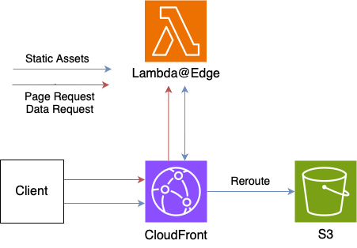

# edge-bundled

This architecture uses CloudFront with S3 as the origin.
Static assets are served from S3, and page data requests are handled by Lambda@Edge.

## Pros

- Unlimited SSG
- Low round trip by Lambda@Edge

## Cons

- Streaming responses are not available due to Lambda@Edge limitations
- Poor Lambda execution environment. Applying Lambda@Edge [Viewer Request limits](https://docs.aws.amazon.com/AmazonCloudFront/latest/DeveloperGuide/cloudfront-limits.html#limits-lambda-at-edge)

## Use cases

- Large scale SSG
- Small amount of server processing

## Additional limitations

- The server always sends the response body as text.
