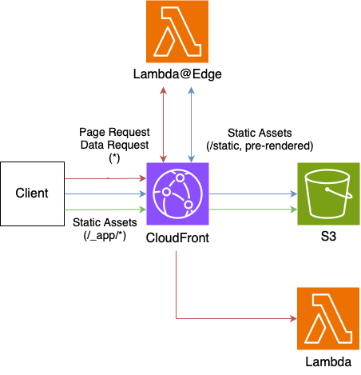

# edge-unbundled

This architecture uses CloudFront with S3 and Lambda as origins.
All requests are first sent to Lambda@Edge, which performs routing and rewriting to a single origin.
Static assets are then served in S3 and page data requests are served in Lambda.

## Pros

- Unlimited SSG
- Normal Lambda execution environment

## Cons

- Require many resource & request

Depending on your Edge location and where your Lambda is running, the round trip can be worse as it goes through multiple resources in AWS.

Full deployment of CloudFront and Lambda@Edge can take some time.

## Use cases

- Large scale web application
