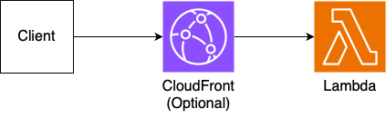

# lambda-mono

In this architecture, all artifacts (including static assets) are uploaded to a single Lambda, and all requests are handled by that Lambda.

## Pros

- Fast deploy
- Easy to debug, logging, trace

## Cons

- Poor scaling

Since a single Lambda handles all requests involving static assets, you are likely to hit concurrency limits. Enabling CloudFront alleviates this issue, but is not recommended for production use.

## Example use case

- Test
- Development

## Notices

- Lambda IAM authentication is unavailable when enable CloudFront
- CloudFront caches only client assets (/\_app/\*).
- The total file size must be less than the Lambda package size limit (50MB: Zipped, 250MB: Unzipped). (Including client assets, server scripts, and pre-rendered pages)
