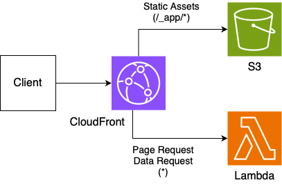

# lambda-s3

This architecture uploads static assets to S3 and handles server requests with Lambda.

## Pros

- Reducing Lambda load

## Cons

- Require Multiple Origin

If you use your custom domain, you will need to manage multiple domains such as subdomains.

- Limited Pre-rendering

Pre-rendered content is served from Lambda to unify the origin. When using a large SSG, you may reach the Lambda package size limit. (50MB:zipped, 250MB:unzipped)

## Use cases

- Standard web app
